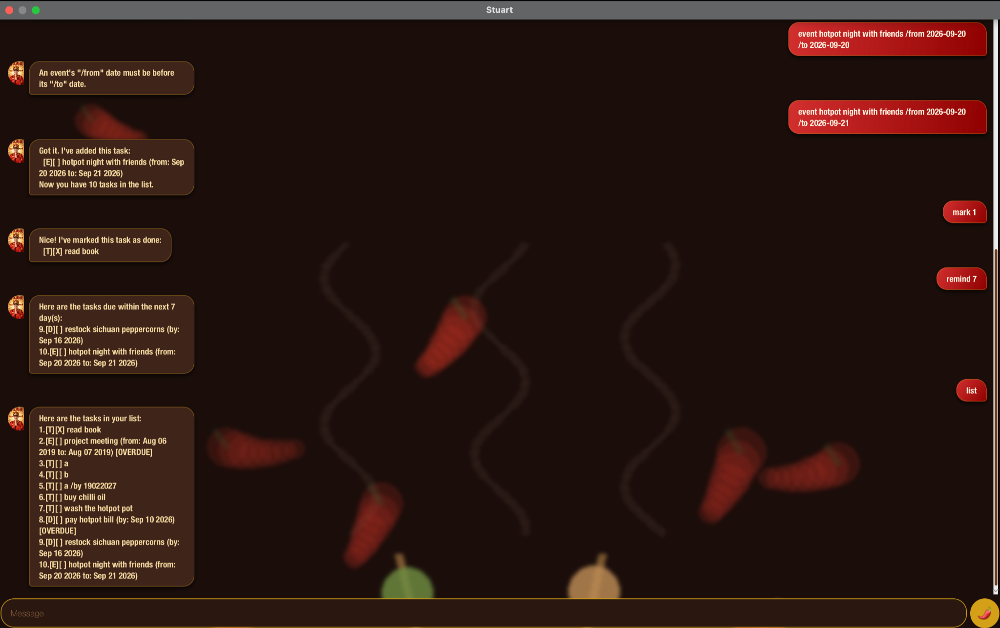

# Stuart User Guide



Stuart is a desktop chatbot for tracking your tasks — todos, deadlines, and events — via a chat window. It's optimized for typing: if you can type fast, Stuart can manage your tasks quicker than a traditional point-and-click app.

* [Quick start](#quick-start)
* [Features](#features)
  * [Adding a todo: `todo`](#adding-a-todo-todo)
  * [Adding a deadline: `deadline`](#adding-a-deadline-deadline)
  * [Adding an event: `event`](#adding-an-event-event)
  * [Listing all tasks: `list`](#listing-all-tasks-list)
  * [Listing tasks sorted by date: `sorted`](#listing-tasks-sorted-by-date-sorted)
  * [Finding tasks on a date: `on`](#finding-tasks-on-a-date-on)
  * [Finding tasks by keyword: `find`](#finding-tasks-by-keyword-find)
  * [Getting reminders: `remind`](#getting-reminders-remind)
  * [Marking a task as done: `mark`](#marking-a-task-as-done-mark)
  * [Marking a task as not done: `unmark`](#marking-a-task-as-not-done-unmark)
  * [Deleting a task: `delete`](#deleting-a-task-delete)
  * [Exiting the program: `bye`](#exiting-the-program-bye)
  * [Saving the data](#saving-the-data)
* [Command summary](#command-summary)

## Quick start

1. Ensure you have Java 25 or above installed on your computer.
2. Download the latest `stuart.jar` from the [releases page](https://github.com/skhaw2004/ip/releases).
3. Copy the file to the folder you want to use as the _home folder_ for Stuart.
4. Open a terminal in that folder and run:
   ```
   java -jar stuart.jar
   ```
   The chat window should appear in a few seconds.
5. Type a command into the message box and press Enter (or click the 🌶 send button) to run it. Some examples:
   * `list` — shows all your tasks.
   * `todo buy chili oil` — adds a todo task.
   * `deadline pay hotpot bill /by 2026-09-10` — adds a deadline.
6. Refer to the [Features](#features) below for details of each command.

## Features

> 💡 Words in `UPPER_CASE` are parameters you supply, e.g. in `todo DESCRIPTION`, `DESCRIPTION` is a parameter you can replace with `todo buy chili oil`.
>
> Dates must be written as `yyyy-MM-dd` (e.g. `2026-09-14`), and must be real calendar dates.

### Adding a todo: `todo`

Adds a todo — a task with no date or time attached — to your list.

Format: `todo DESCRIPTION`

Example: `todo buy chili oil`

```
Got it. I've added this task:
  [T][ ] buy chili oil
Now you have 1 tasks in the list.
```

### Adding a deadline: `deadline`

Adds a task that needs to be done by a specific date.

Format: `deadline DESCRIPTION /by DATE`

Example: `deadline pay hotpot bill /by 2026-09-10`

```
Got it. I've added this task:
  [D][ ] pay hotpot bill (by: Sep 10 2026) [OVERDUE]
Now you have 2 tasks in the list.
```

A deadline that's already passed and isn't marked done, like the one above, is flagged `[OVERDUE]` wherever it's shown.

### Adding an event: `event`

Adds a task that spans a start and end date.

Format: `event DESCRIPTION /from DATE /to DATE`

Example: `event hotpot night with friends /from 2026-09-20 /to 2026-09-21`

```
Got it. I've added this task:
  [E][ ] hotpot night with friends (from: Sep 20 2026 to: Sep 21 2026)
Now you have 3 tasks in the list.
```

`/from` must be strictly before `/to` — Stuart will reject a backwards or same-day range with an error instead of adding it.

> ℹ️ Stuart also rejects a `todo`/`deadline`/`event` that's an exact duplicate of one already in your list (same type, description, and dates), so you don't end up with the same task twice by accident.

### Listing all tasks: `list`

Shows every task currently in your list, numbered in the order they were added.

Format: `list`

### Listing tasks sorted by date: `sorted`

Shows every task ordered by date (deadlines by their `/by` date, events by their `/from` date), with dateless todos listed last.

Format: `sorted`

### Finding tasks on a date: `on`

Shows the tasks occurring on a specific date — a deadline due that day, or an event whose range includes it.

Format: `on DATE`

Example: `on 2026-09-20`

### Finding tasks by keyword: `find`

Shows the tasks whose description contains a given keyword (case-sensitive).

Format: `find KEYWORD`

Example: `find hotpot`

### Getting reminders: `remind`

Shows the tasks due within the next few days — handy for a quick check of what's coming up without scrolling through everything.

Format: `remind` or `remind DAYS`

* `remind` on its own looks 3 days ahead.
* `remind DAYS` looks the given number of days ahead instead.

Example: `remind 7`

```
Here are the tasks due within the next 7 day(s):
9.[D][ ] restock sichuan peppercorns (by: Sep 16 2026)
10.[E][ ] hotpot night with friends (from: Sep 20 2026 to: Sep 21 2026)
```

### Marking a task as done: `mark`

Marks a task as done, using the number shown in `list`/`sorted`/`find`/`on`/`remind`.

Format: `mark INDEX`

Example: `mark 1`

```
Nice! I've marked this task as done:
  [T][X] read book
```

### Marking a task as not done: `unmark`

Reverts a task back to not-done.

Format: `unmark INDEX`

Example: `unmark 1`

### Deleting a task: `delete`

Removes a task from your list.

Format: `delete INDEX`

Example: `delete 3`

### Exiting the program: `bye`

Says goodbye and closes the chat.

Format: `bye`

### Saving the data

Stuart automatically saves your task list to disk after every command that adds, deletes, or marks a task — there's no separate save command, and no data is lost between sessions.

## Command summary

| Action | Format | Example |
|---|---|---|
| Todo | `todo DESCRIPTION` | `todo buy chili oil` |
| Deadline | `deadline DESCRIPTION /by DATE` | `deadline pay hotpot bill /by 2026-09-10` |
| Event | `event DESCRIPTION /from DATE /to DATE` | `event hotpot night /from 2026-09-20 /to 2026-09-21` |
| List | `list` | `list` |
| Sorted | `sorted` | `sorted` |
| On | `on DATE` | `on 2026-09-20` |
| Find | `find KEYWORD` | `find hotpot` |
| Remind | `remind [DAYS]` | `remind 7` |
| Mark | `mark INDEX` | `mark 1` |
| Unmark | `unmark INDEX` | `unmark 1` |
| Delete | `delete INDEX` | `delete 3` |
| Bye | `bye` | `bye` |
